# IB_TP_PYTHON
Ceci est le TP demander par IB afin de manipuler les difféntes partie Jenkins, Python, Linux, Vagrant, UML, Gradle, Nexus

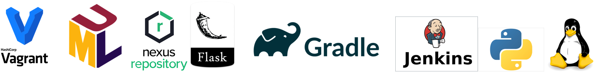


## Structure du projet 
### Les répertoir 
- [./script/](./script/) : contient les scripts python de l'application de gestion Park Informatique
- [./UML/](./UML/) : contient les roches pour la modélisation de la partie UML
- [./VagrantFiles/](./VagrantFiles/) : contient les fichiers utiles pour déployer les machines virtuelles ainsi que leur scripts provision pour l'installation des prérequis
  - [./VagrantFiles/IC-Gradle/](./VagrantFiles/IC-Gradle/) : ~~ à supprimer~~
  - [./VagrantFiles/IC-Jenkins/](./VagrantFiles/IC-Jenkins/) : gérer la machine virtuelle de Jenkins
  - [./VagrantFiles/IC-Nexus/](./VagrantFiles/IC-Nexus/) : gérer la machine virtuelle de Nexus 
Pour déployer les machines virtuelles, il suffit juste de se situer sur le dossier contenant le fichier 'vagrantfile' puis lancer la commande ci-dessous (l'installation vagrant sur la machine nécessaire) :
```console
hoos@ib:~$ vagrant up
```
- [./doc/](./doc/) : contient les fichier et image utile a la documentation et l'alimentation du fichier readme.me
### fichier BUILD
- [build.gradle](build.gradle)  : fichier gradle qui permet a faire le BUILD de l'application.Ce fichier gradle va nous permetre a vider les dossiers et fichier temporaire, installation des dépendance, packaging, le stockage sur le répository Nexus et l'execussion des test unitaire. Le lancement ce fait en tapant la commande ci-dessous:
```console
hoos@ib:~$ gradle runpy 
```
- [gradle.properties](gradle.properties) : ce fichier va nous permettre la gérer la version de l'application python à builder.
### fichier de l'application
- [./script/nexusAPI.py](./script/nexusAPI.py) : ce script va nous afficher les versions de notre application existante sur Nexus OSS Repository à l'aide de l'API
- [./script/apimachine.py](./script/apimachine.py) : ce script est la couche API de l'application Python gestion park informatique qui va êtres éxecuter via le framework Flask
- [./script/crudmachine.py](./script/crudmachine.py) : ce script est la couche buisness de l'application Python gestion park informatique. c'est le coeur de l'application qui va êtres appeler par tous les autre couches de notre application Python.
- [./script/interactivemachine.py](./script/interactivemachine.py) : c'est la partie qui va garantir l'interaction avec l'utilisateur pour exploiter les services de notre application via les ligne de commande.
- [./script/launchAPI.py](./script/launchAPI.py) : A supprimer. BUT : tentative d'executer le serveur Flask dans un autre Thread sans blocké Gradle.
- [./script/objectsmachine.py](./script/objectsmachine.py) : ce script est la couche model de notre application, il permet de déclarer les différents objets nécessaires pour tous les couche de l'application Gestion Park Informatique 
- [./script/unitestmachine.py](./script/unitestmachine.py) : ce script est la couche test de notre application, il va executer les Test Unitaire liée cette application. Ce dérnier va être appeler par Gradle.
- [./script/OS_version.txt](./script/OS_version.txt) : ce fichier est un fichier persistant qui contient la liste des OS pour les affecter au host lors des mise à jour des machine
- [./script/hdd.csv](./script/hdd.csv) : ce fichier est un fichier persistant qui contient la liste des dique dure liée au différente machines affecter lors des mise à jour des machine
- [./script/machines.csv](./script/machines.csv) : ce fichier est un fichier persistant qui contient la liste des machinesmanipuler lors des mise à jour des machines

l'application va être executer sous le port 5000

### fichier XML Jenkins
[./doc/Job_Jenkins_config.xml](./doc/Job_Jenkins_config.xml) : fichier XML décrivant le pipeline du Job Jenkins que vous pouvez l'importer dans votre serveur Jenkins pour l'executer aprés. 

## API
[Fichier déscriptif des service REST API de notre application Pythin](doc/export_postman_python_TP.json)

## Diagramme UML
Nous avons élaborer un diagramme UML pour décrire notre application

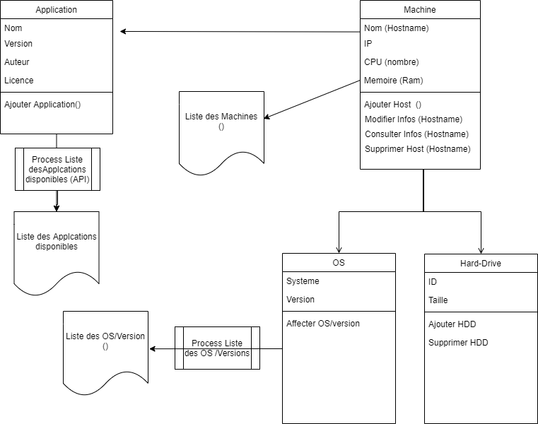
*Diagramme UML*

Les diagrammes de cas d'utilisation (DCU) sont des diagrammes UML utilisés pour une représentation du comportement fonctionnel d'un système logiciel. Ils sont utiles pour des présentations auprès de la direction ou des acteurs d'un projet, mais pour le développement, les cas d'utilisation sont plus appropriés.

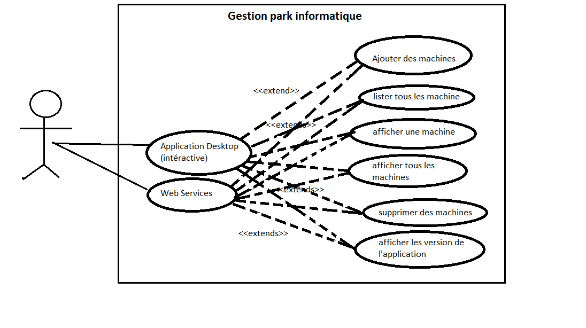
*Diagramme UML des cas d'utilisation de notre applicaton Gestion park informatique*

Le diagramme de composants décrit l'organisation du système du point de vue des éléments logiciels comme les modules (paquetages, fichiers sources, bibliothèques, exécutables)

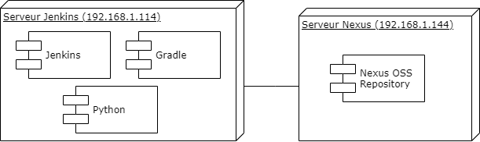
*Diagramme UML des composants de notre infrastructure*


## Configuration Nexus OSS Repository
Addresse IP : 192.168.1.144:8081

Pour ajouter un nouveau repository des fichiers ZIP il suffit d'aller au menu configuration, puis clicker sur repository puis clicker sur "New Repository" puis séléctionner sur "raw (hosted)" puis taper le nom du repository, ici "nexus-tpp",ensuite laisser tous les par défaut avant de clicker sur OK

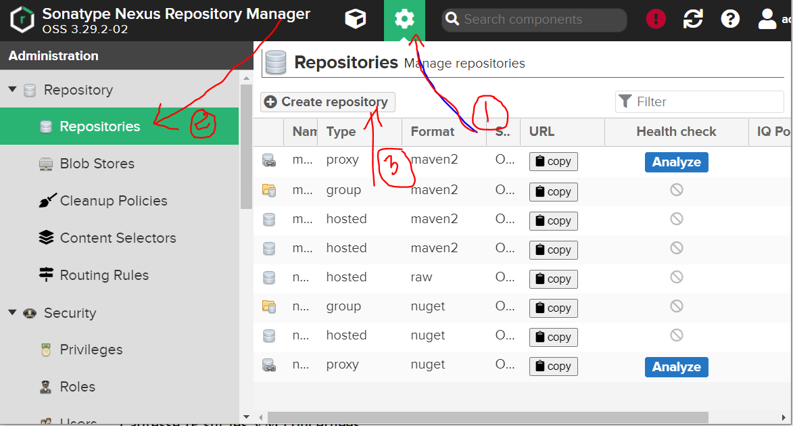
*Imprime écrant illustrant comment ajouter un Répository sur Nexus OSS*

## Configuration Jenkins
Addresse IP : 192.168.1.114:8080

### Configuration prérequis Jenkins
Nous avons indiquer l'addresse relative de l'application Gradle pour que Jenkins réussie a executer la commande gradle.

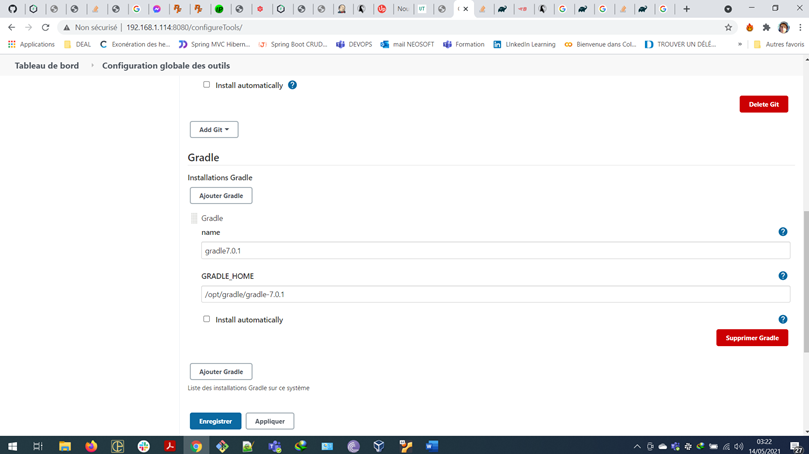
*Capture d'écran de la configuration de Gradle 7.0.1 sur Jenkins*

### Configuration JOB Jenkins
Aprés la création d'un nouveau Job Jenkins, on va configurer le répo. Github comme indique l'imprime écran ci-dessous
PS : n'oublier pas de cocher la case de Github webhook.

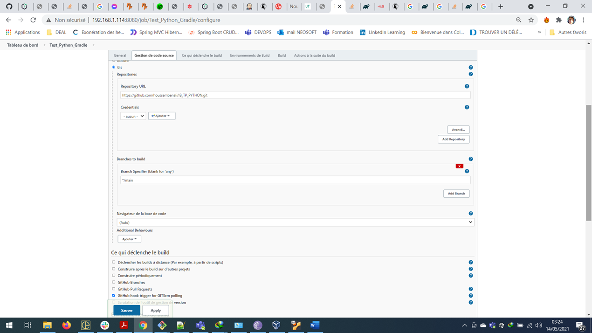
*Capture d'écran de la configuration du répo. Github dans la config. du job*

On va configurer la dérniére étape du Job c'est la configuration du build on séléctionnant la version Gradle précédament configurer et indiquant la tâche Gradle a executer. 

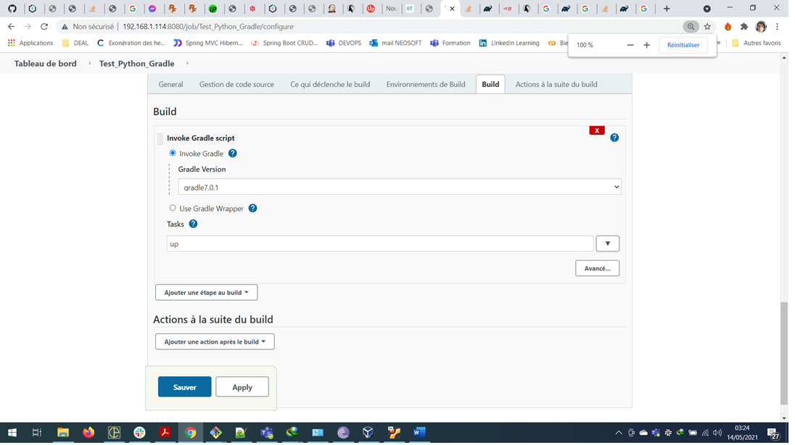
*Capture d'écran de la configuration de l'étape Build Gradle indiquant la version Gradle et la tâche a executer*

## Configuration Webhook

Le Webhook va nous permettre d'envoyer un signal a une déstination pour par exemple déclancher un Job de Jenkins comme dans notre cas.
On commence par configurer le Webhook dans le répo. Github on fournissant l'addresse IP publique (aprés exposition de Jenkins à internet on configurant le routeur)


*Capture d'écran de la configuration du Webhook dans le répo. Github*

Ci-dessous le commit déclancheur qui va déclancher un signal vers Jenkins qui va déclancher un Job build.

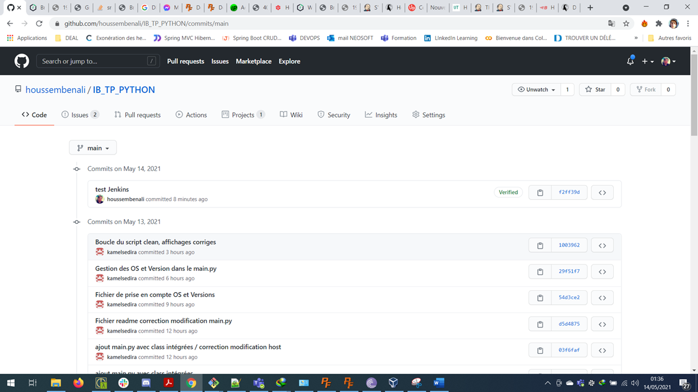
*Capture d'écran du commit déclancheur de Webhook*

l'imprime écran ci-dessous nous affiche que le signal webhook a été envoyer avec succée (en vert)

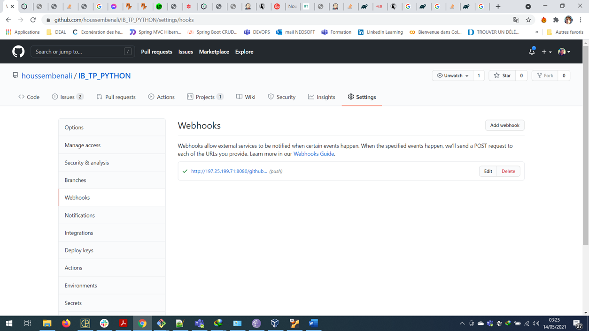
*Capture d'écran de l'état en succée du webhook Github vers Jenkins*

L'imprime écran ci-dessous indique que le job Jenkins a été executer suite au signal webhook reçu par github.

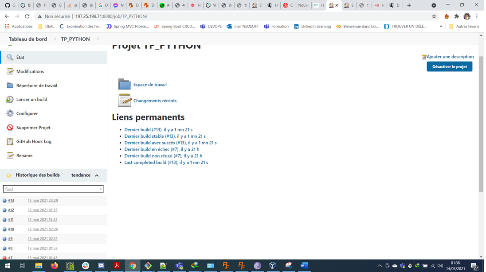
*Capture d'écran du lancement du job Jenkins suis signal webhook envoyé par Github*

On indique ici le log des événnement webhook Jenkins reçu de la part de Github.

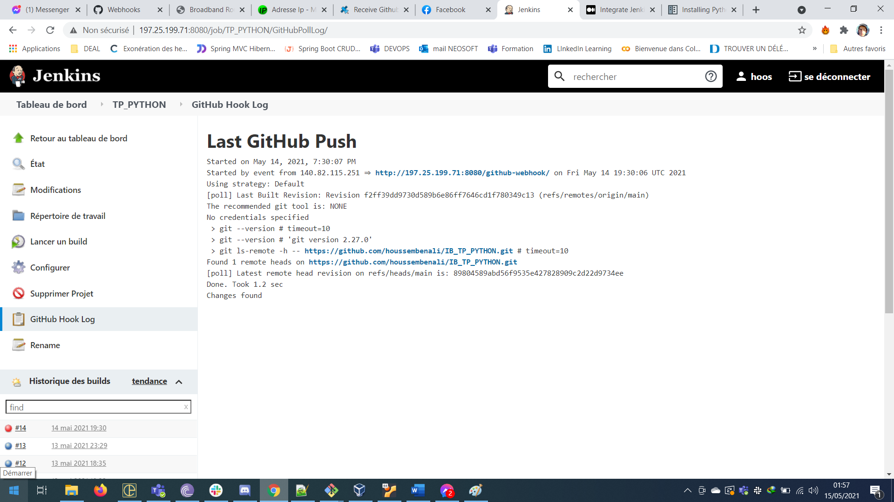
*Capture d'écran du log de la rebrique webhook sur Jenkins*
